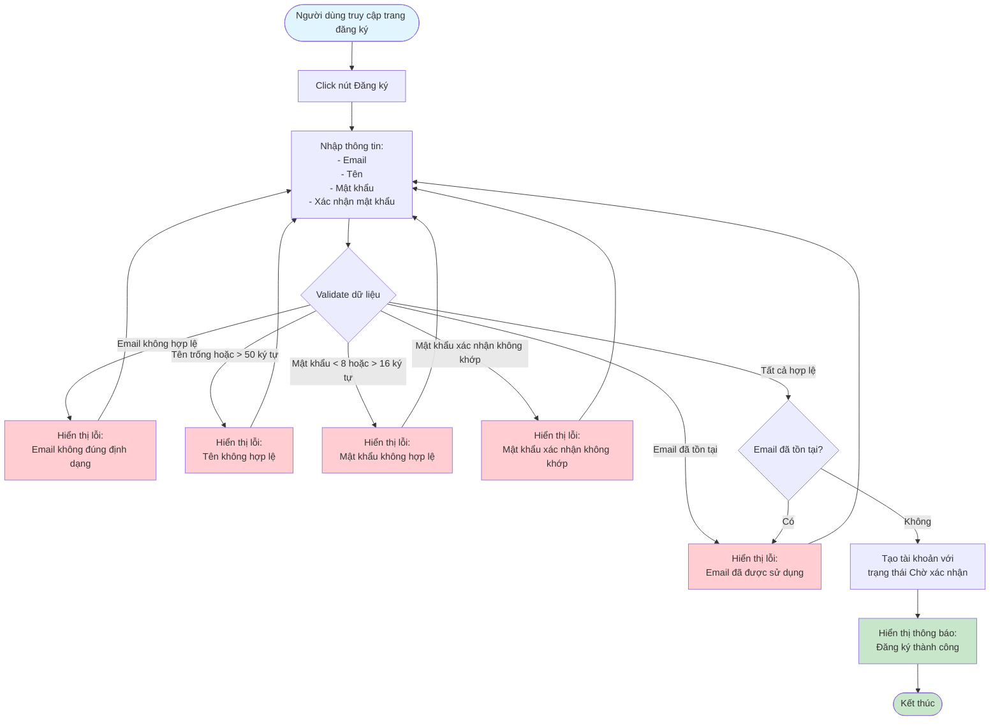

# 2.1.1 Đăng Ký - Flowchart

## Mô tả
Tính năng đăng ký tài khoản mới cho người dùng.

**Actor:** Mọi người  
**Phụ thuộc:** Không

## Flowchart

## Validation Rules

- **Email:** Định dạng email hợp lệ
- **Tên:** Không được để trống, tối đa 50 ký tự
- **Mật khẩu:** Không được để trống, tối thiểu 8 ký tự, tối đa 16 ký tự
- **Confirm mật khẩu:** Không được để trống, phải trùng với mật khẩu

## Luồng thay thế

1. **Email đã tồn tại:** Hiển thị thông báo lỗi và yêu cầu sử dụng email khác
2. **Validation lỗi:** Hiển thị lỗi cụ thể cho từng trường không hợp lệ

## Edge Cases

- Email không đúng định dạng
- Mật khẩu quá ngắn hoặc quá dài
- Mật khẩu xác nhận không khớp
- Email đã được sử dụng bởi tài khoản khác

