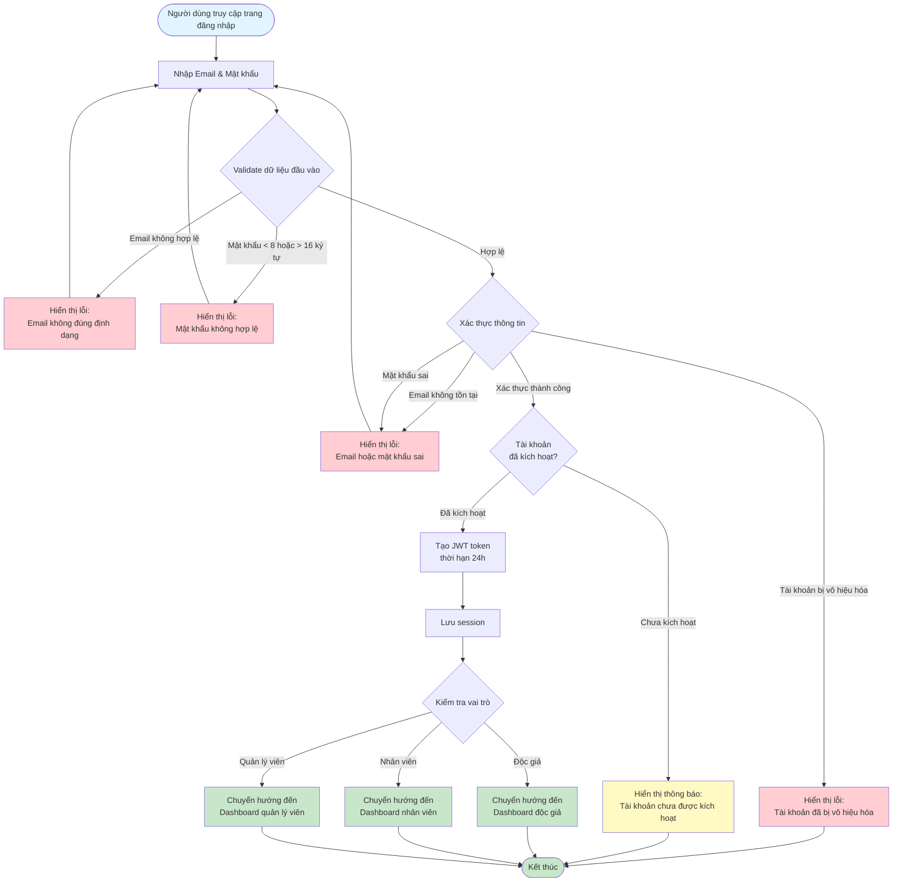

# 2.1.2 Đăng Nhập - Flowchart

## Mô tả
Tính năng đăng nhập vào hệ thống.

**Actor:** Mọi người  
**Phụ thuộc:** 2.1.1 (Cần có tài khoản)

## Flowchart

## Validation Rules

- **Email:** Định dạng email hợp lệ
- **Mật khẩu:** Không được để trống, tối thiểu 8 ký tự, tối đa 16 ký tự

## Luồng thay thế

1. **Thông tin đăng nhập sai:** Hiển thị thông báo lỗi chung (không tiết lộ email có tồn tại hay không)
2. **Tài khoản chưa được kích hoạt:** Hiển thị thông báo và yêu cầu liên hệ quản trị viên

## Edge Cases

- Email hoặc mật khẩu sai
- Tài khoản bị vô hiệu hóa
- Tài khoản chưa được kích hoạt
- Token hết hạn (sau 24h) - xử lý ở middleware

