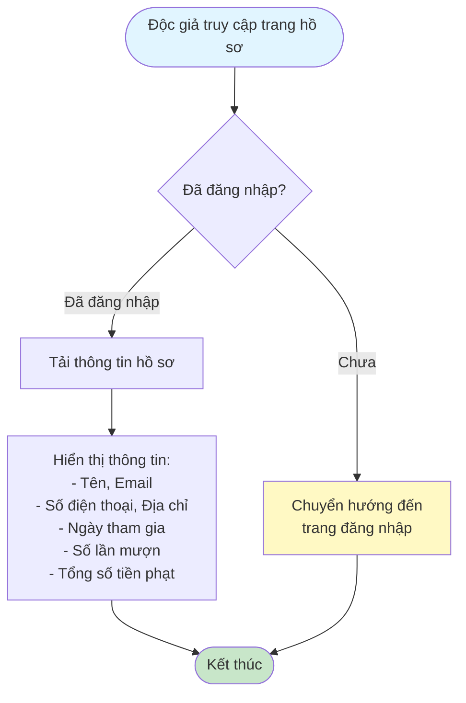
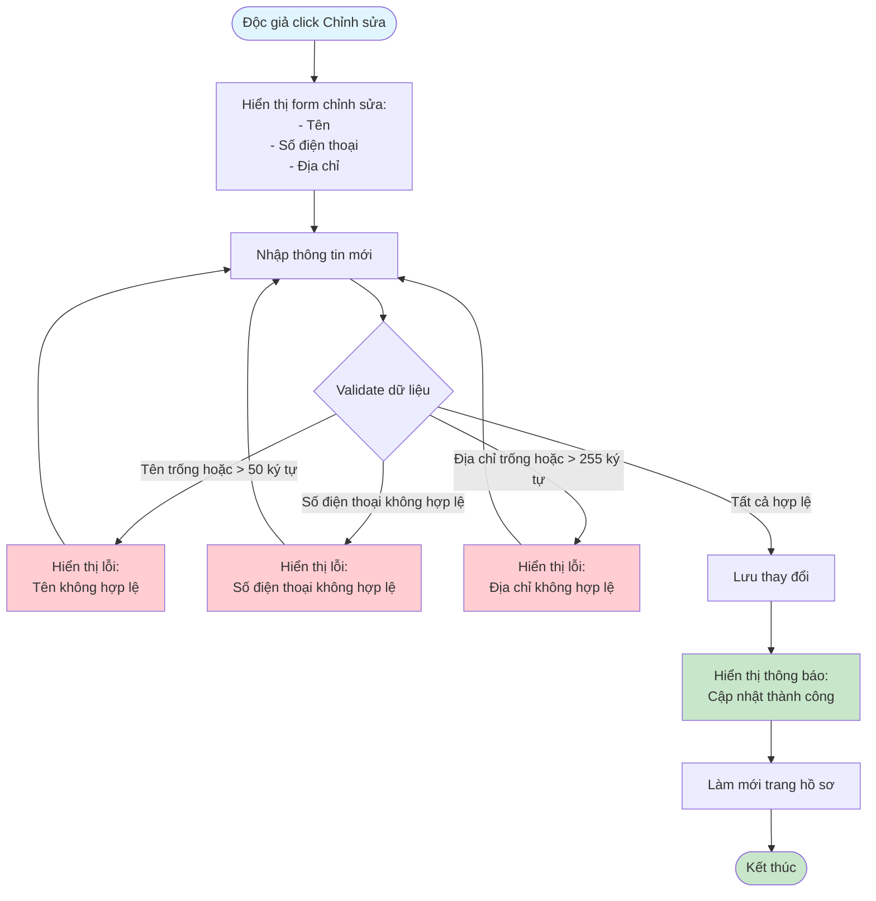
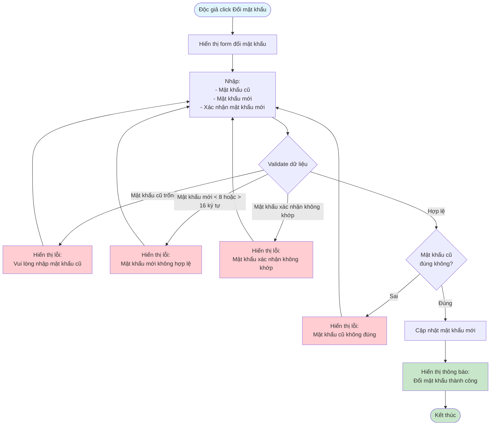

# 2.1.3 Hồ Sơ Cá Nhân - Flowchart

## Mô tả
Tính năng xem và cập nhật thông tin cá nhân, đổi mật khẩu.

**Actor:** Độc giả  
**Phụ thuộc:** 2.1.2 (Cần đăng nhập)

## Flowchart - Xem Hồ Sơ

## Flowchart - Cập Nhật Thông Tin

## Flowchart - Đổi Mật Khẩu

## Validation Rules

- **Tên:** Không được để trống, tối đa 50 ký tự
- **Số điện thoại:** Định dạng số điện thoại hợp lệ
- **Địa chỉ:** Không được để trống, tối đa 255 ký tự
- **Mật khẩu cũ:** Bắt buộc nhập
- **Mật khẩu mới:** Tối thiểu 8 ký tự, tối đa 16 ký tự
- **Xác nhận mật khẩu:** Phải khớp với mật khẩu mới

## Luồng thay thế

1. **Validation lỗi:** Hiển thị lỗi cụ thể cho từng trường
2. **Mật khẩu cũ sai:** Hiển thị thông báo lỗi và yêu cầu nhập lại

## Edge Cases

- Mật khẩu cũ không đúng
- Mật khẩu mới không đủ độ dài
- Mật khẩu xác nhận không khớp
- Chưa đăng nhập (redirect về trang đăng nhập)

