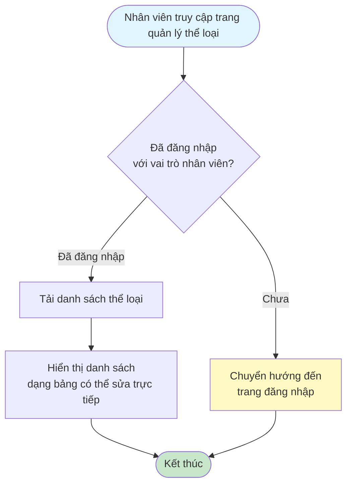
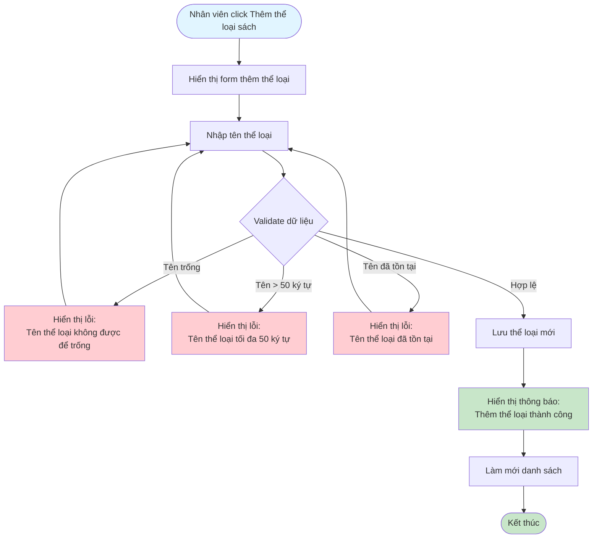
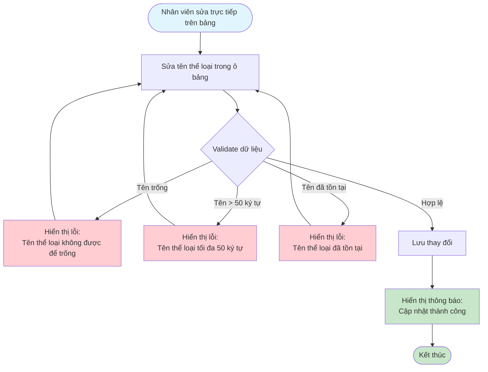
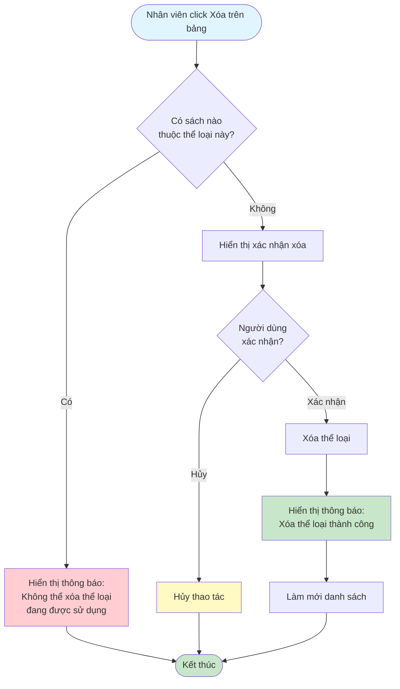

# 2.2.1 Quản lý Thể Loại Sách - Flowchart

## Mô tả
Tính năng quản lý thể loại sách: xem, thêm, sửa, xóa thể loại.

**Actor:** Nhân viên thư viện  
**Phụ thuộc:** 2.1.2 (Cần đăng nhập với vai trò nhân viên)

## Flowchart - Xem Danh Sách

## Flowchart - Thêm Thể Loại

## Flowchart - Sửa Thể Loại

## Flowchart - Xóa Thể Loại

## Validation Rules

- **Tên thể loại:** Không được để trống, tối đa 50 ký tự

## Luồng thay thế

1. **Có sách thuộc thể loại:** Không cho phép xóa, hiển thị thông báo
2. **Tên thể loại đã tồn tại:** Hiển thị lỗi và yêu cầu nhập tên khác

## Edge Cases

- Tên thể loại trống
- Tên thể loại quá dài (>50 ký tự)
- Xóa thể loại đang được sử dụng
- Tên thể loại trùng với thể loại khác

