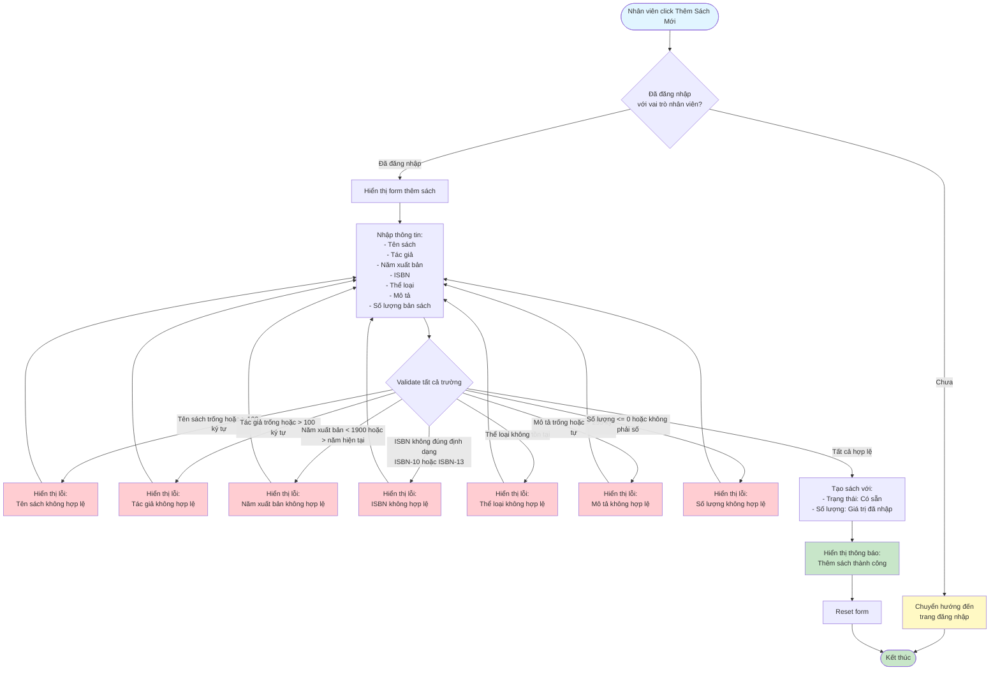

# 2.2.2 Thêm Sách Mới - Flowchart

## Mô tả
Tính năng thêm sách mới vào hệ thống.

**Actor:** Nhân viên thư viện  
**Phụ thuộc:** 2.1.2, 2.2.1 (Cần đăng nhập và có thể loại sách)

## Flowchart

## Validation Rules

- **Tên sách:** Không được để trống, tối đa 100 ký tự
- **Tác giả:** Không được để trống, tối đa 100 ký tự
- **Năm xuất bản:** Năm hợp lệ (1900 - năm hiện tại)
- **ISBN:** Định dạng chuẩn ISBN-10 hoặc ISBN-13 (nếu có)
- **Thể loại:** Phải có thể loại sách (chọn từ dropdown)
- **Mô tả:** Không được để trống, tối đa 255 ký tự
- **Số lượng:** Phải > 0, kiểu số

## Luồng thay thế

1. **Validation lỗi:** Hiển thị lỗi cụ thể cho từng trường không hợp lệ
2. **Thể loại không tồn tại:** Hiển thị lỗi và yêu cầu chọn thể loại hợp lệ

## Edge Cases

- Tên sách/tác giả trống hoặc quá dài
- ISBN không đúng định dạng (ISBN-10 hoặc ISBN-13)
- Số lượng <= 0 hoặc không phải số
- Năm xuất bản không hợp lệ (1900 - năm hiện tại)
- Thể loại không tồn tại
- Mô tả trống hoặc quá dài
- Chưa có thể loại sách nào trong hệ thống

