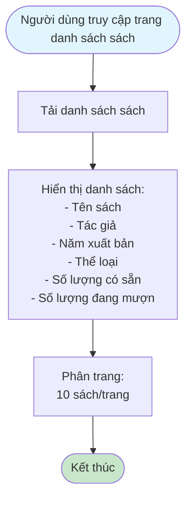
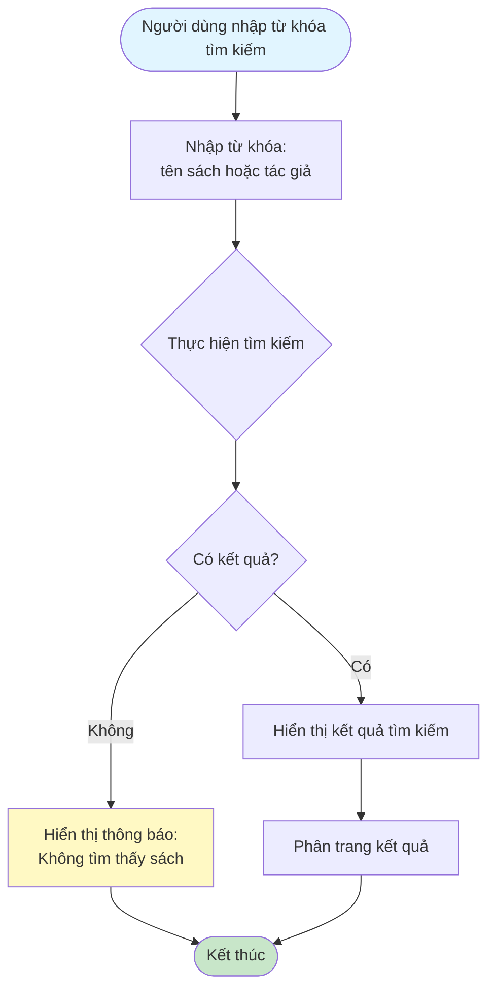
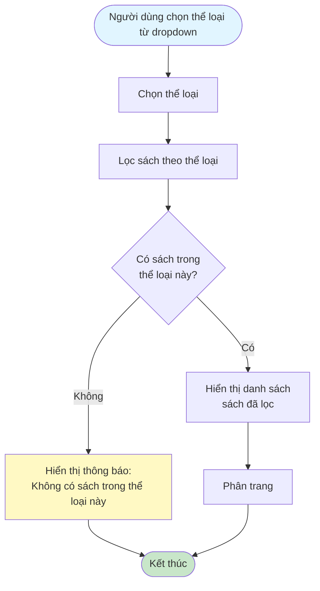
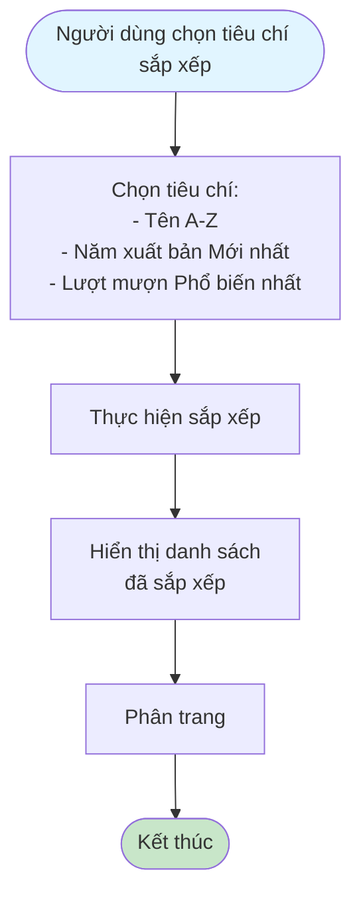
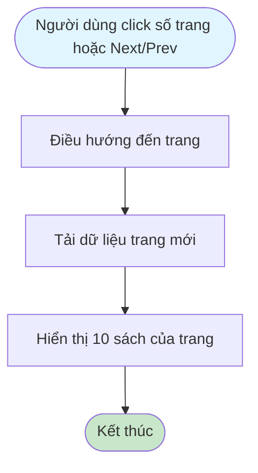

# 2.2.3 Xem Danh Sách Sách - Flowchart

## Mô tả
Tính năng xem danh sách sách với tìm kiếm, lọc, sắp xếp và phân trang.

**Actor:** Tất cả người dùng (không cần login)  
**Phụ thuộc:** Không

## Flowchart - Xem Danh Sách

## Flowchart - Tìm Kiếm

## Flowchart - Lọc Theo Thể Loại

## Flowchart - Sắp Xếp

## Flowchart - Phân Trang

## Chức năng

- **Tìm kiếm:** Theo tên sách hoặc tác giả
- **Lọc:** Theo thể loại
- **Sắp xếp:** 
  - Tên (A-Z)
  - Năm xuất bản (Mới nhất)
  - Lượt mượn (Phổ biến nhất)
- **Phân trang:** 10 sách trên 1 trang

## Luồng thay thế

1. **Không có kết quả tìm kiếm:** Hiển thị thông báo "Không tìm thấy sách"
2. **Không có sách trong thể loại:** Hiển thị thông báo "Không có sách trong thể loại này"

## Edge Cases

- Không có kết quả tìm kiếm
- Không có sách trong thể loại đã chọn
- Danh sách sách rỗng
- Kết hợp tìm kiếm + lọc + sắp xếp

