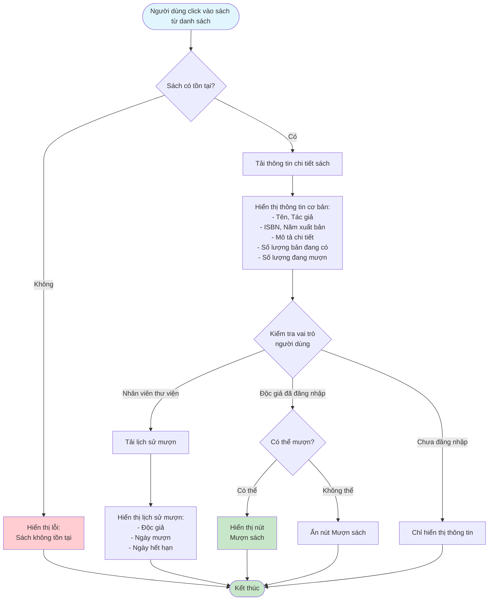

# 2.2.4 Xem Chi Tiết Sách - Flowchart

## Mô tả
Tính năng xem thông tin chi tiết của một cuốn sách.

**Actor:** Tất cả người dùng (không cần login)  
**Phụ thuộc:** 2.2.3 (Cần có danh sách sách)

## Flowchart

## Thông tin hiển thị

- **Tất cả người dùng:**
  - Tên, Tác giả, ISBN, Năm xuất bản
  - Mô tả chi tiết
  - Số lượng bản đang có, đang mượn

- **Nhân viên thư viện:**
  - Lịch sử mượn (Độc giả, Ngày mượn, Ngày hết hạn)

- **Độc giả đã đăng nhập:**
  - Nút "Mượn sách" (nếu đủ điều kiện)

## Luồng thay thế

1. **Độc giả chưa đăng nhập:** Không hiển thị nút "Mượn sách"
2. **Sách không tồn tại:** Hiển thị lỗi 404 hoặc thông báo "Sách không tồn tại"

## Edge Cases

- Sách không tồn tại
- Không có quyền xem lịch sử mượn (không phải nhân viên)
- Độc giả chưa đăng nhập (không hiển thị nút mượn)
- Sách đã hết (số lượng = 0)

