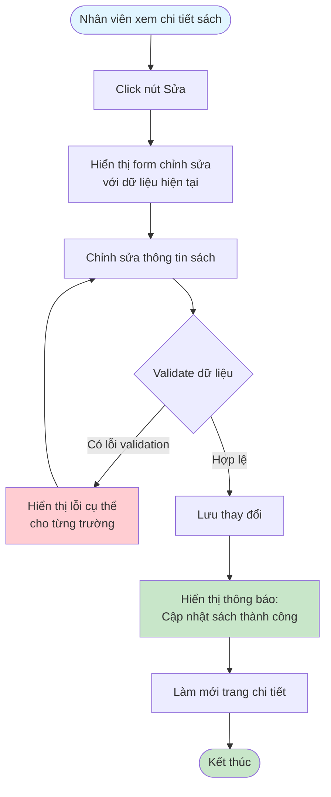
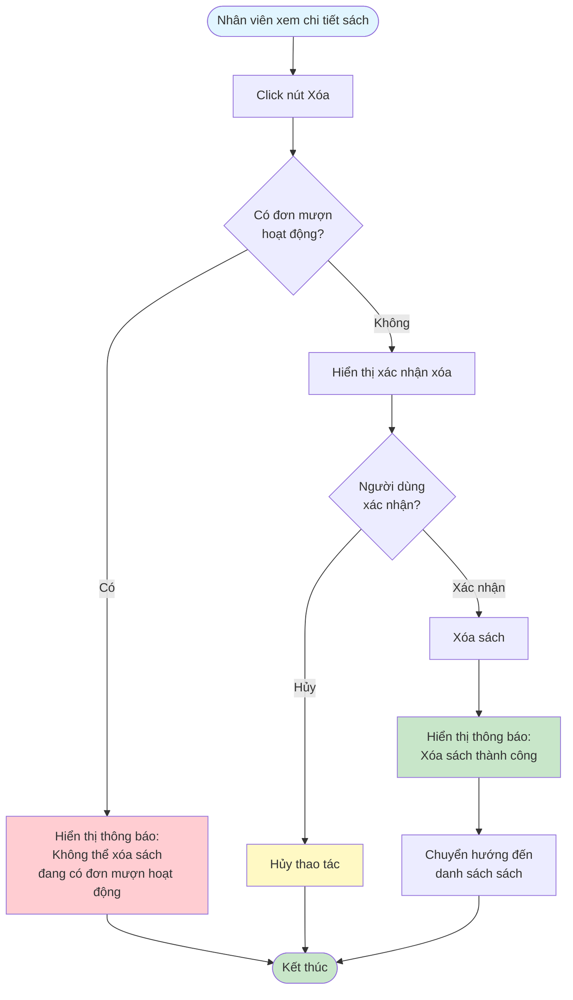

# 2.2.5 Sửa & Xóa Sách - Flowchart

## Mô tả
Tính năng sửa và xóa sách trong hệ thống.

**Actor:** Nhân viên thư viện  
**Phụ thuộc:** 2.1.2, 2.2.4 (Cần đăng nhập và xem chi tiết sách)

## Flowchart - Sửa Sách

## Flowchart - Xóa Sách

## Validation Rules (Khi sửa)

- **Tên sách:** Không được để trống, tối đa 100 ký tự
- **Tác giả:** Không được để trống, tối đa 100 ký tự
- **Năm xuất bản:** Năm hợp lệ (1900 - năm hiện tại)
- **ISBN:** Định dạng chuẩn ISBN-10 hoặc ISBN-13 (nếu có)
- **Thể loại:** Phải có thể loại sách
- **Mô tả:** Không được để trống, tối đa 255 ký tự
- **Số lượng:** Phải > 0, kiểu số

## Luồng thay thế

1. **Có đơn mượn hoạt động:** Không cho phép xóa, hiển thị thông báo
2. **Validation lỗi khi sửa:** Hiển thị lỗi cụ thể cho từng trường

## Edge Cases

- Sách đang có đơn mượn chưa trả → Không thể xóa
- Validation lỗi khi sửa
- Sách không tồn tại (sau khi xóa bởi người khác)
- Không có quyền sửa/xóa (không phải nhân viên)

