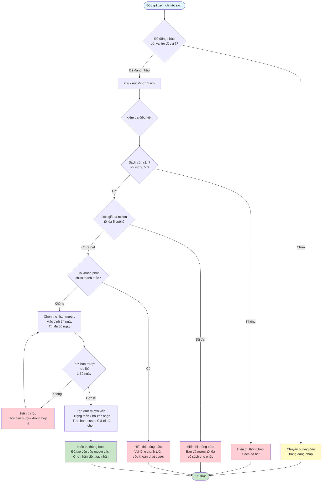

# 2.3.1 Mượn Sách - Độc Giả - Flowchart

## Mô tả
Tính năng độc giả mượn sách từ hệ thống.

**Actor:** Độc giả  
**Phụ thuộc:** 2.1.2, 2.2.4 (Cần đăng nhập và xem chi tiết sách)

## Flowchart

## Điều kiện mượn sách

1. **Sách còn sẵn:** Số lượng > 0
2. **Chưa vượt quá giới hạn:** Độc giả chưa mượn quá 5 cuốn
3. **Không có phạt chưa thanh toán:** Tất cả khoản phạt đã được thanh toán

## Thời hạn mượn

- **Mặc định:** 14 ngày
- **Tối đa:** 30 ngày
- **Tối thiểu:** 1 ngày

## Luồng thay thế

1. **Sách hết:** Hiển thị thông báo "Sách đã hết"
2. **Đã mượn tối đa:** Hiển thị thông báo "Bạn đã mượn tối đa số sách cho phép"
3. **Có phạt chưa thanh toán:** Hiển thị thông báo "Vui lòng thanh toán các khoản phạt trước khi mượn sách"

## Edge Cases

- Sách không còn sẵn (số lượng = 0)
- Đã đạt giới hạn số sách mượn (5 cuốn)
- Có khoản phạt chưa thanh toán
- Thời hạn mượn vượt quá 30 ngày
- Thời hạn mượn < 1 ngày
- Chưa đăng nhập (redirect về trang đăng nhập)

