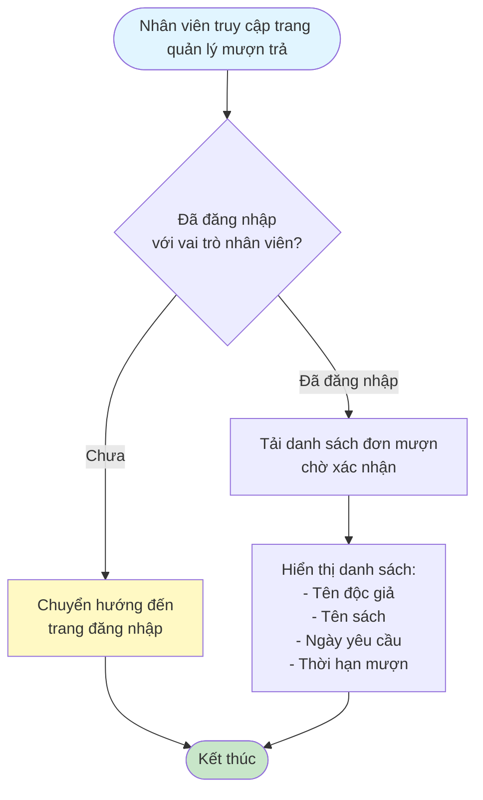
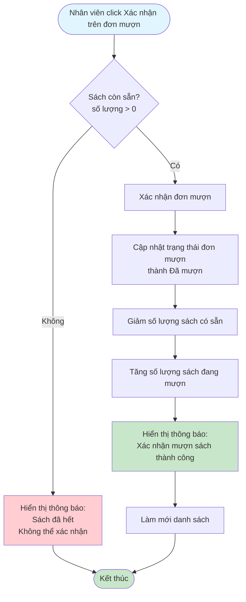
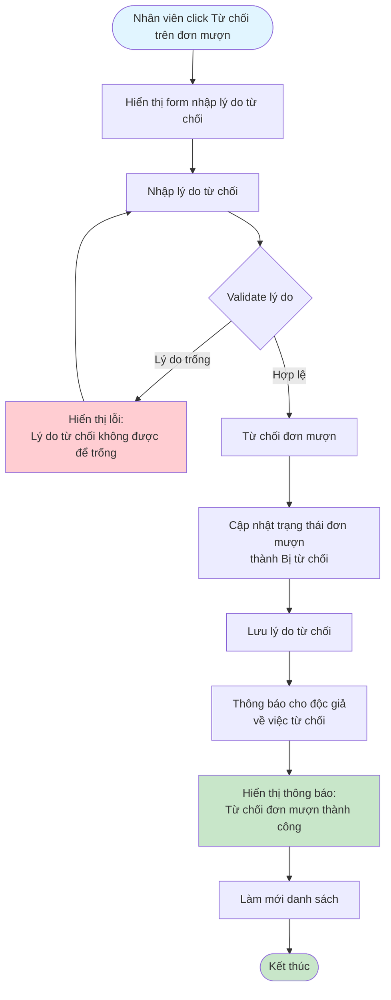

# 2.3.2 Mượn Sách - Nhân Viên Thư Viện - Flowchart

## Mô tả
Tính năng nhân viên thư viện xác nhận hoặc từ chối đơn mượn sách.

**Actor:** Nhân viên thư viện  
**Phụ thuộc:** 2.1.2, 2.3.1 (Cần đăng nhập và có đơn mượn chờ xác nhận)

## Flowchart - Xem Danh Sách Đơn Mượn

## Flowchart - Xác Nhận Đơn Mượn

## Flowchart - Từ Chối Đơn Mượn

## Validation Rules

- **Lý do từ chối:** Bắt buộc nhập, không được để trống

## Luồng thay thế

1. **Không nhập lý do từ chối:** Yêu cầu nhập lý do trước khi từ chối
2. **Sách đã hết khi xác nhận:** Hiển thị thông báo và không cho phép xác nhận

## Edge Cases

- Lý do từ chối trống
- Sách đã hết khi xác nhận (race condition - cần kiểm tra lại trước khi xác nhận)
- Đơn mượn không tồn tại hoặc đã được xử lý
- Không có quyền xác nhận/từ chối (không phải nhân viên)

