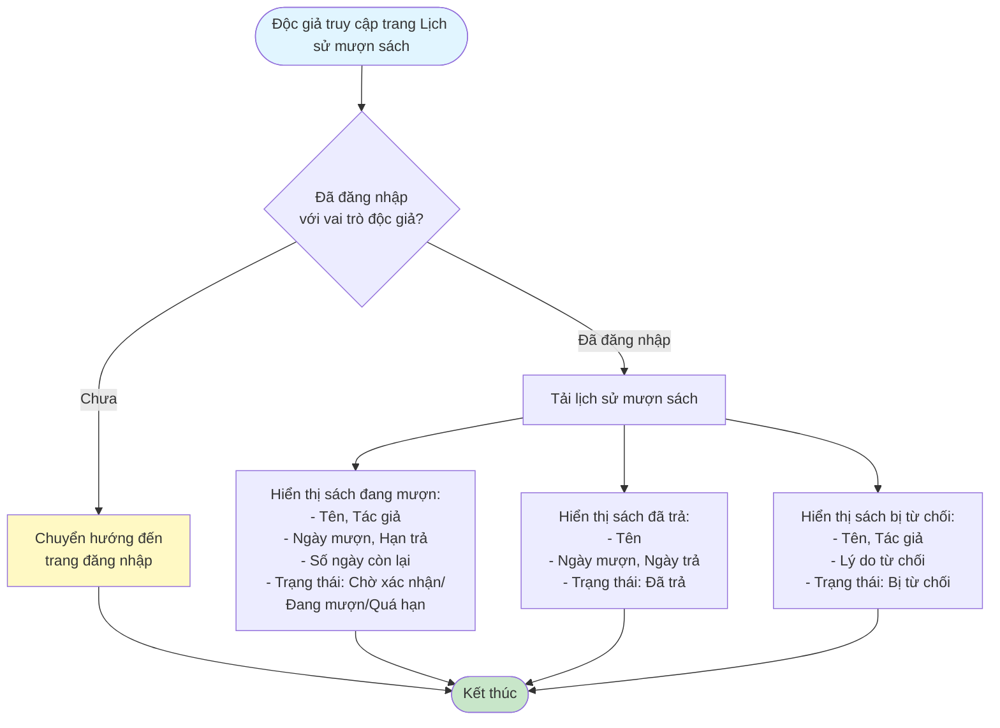
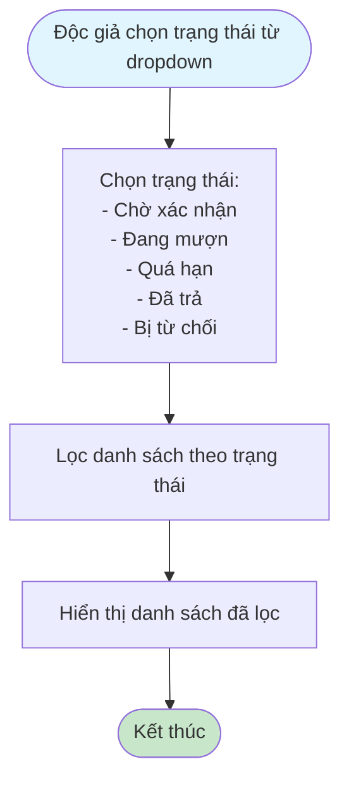
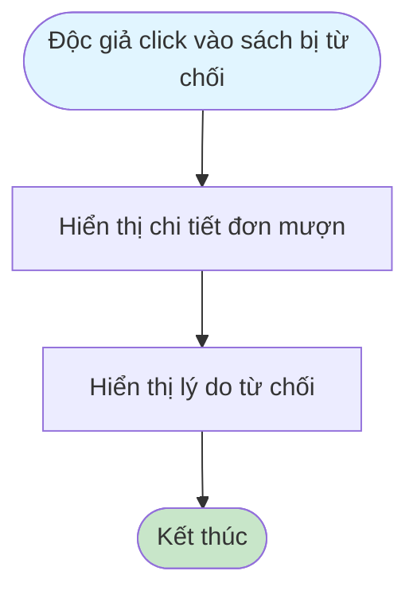
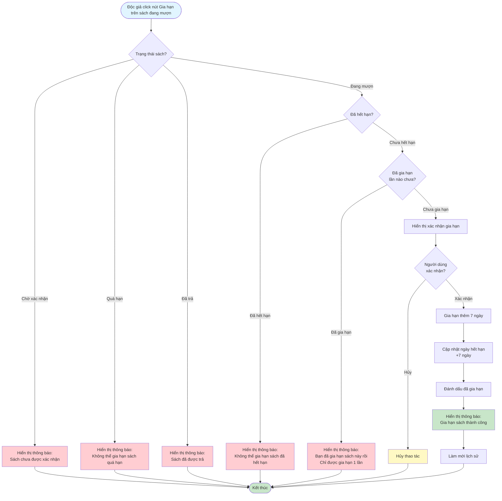
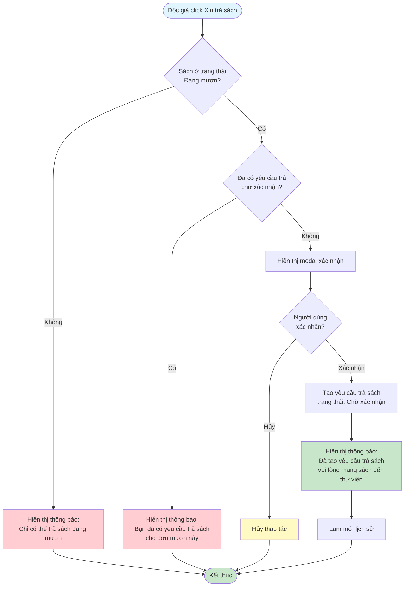

# 2.3.3 Xem Lịch Sử Mượn Sách - Độc Giả - Flowchart

## Mô tả
Tính năng độc giả xem lịch sử mượn sách, gia hạn sách, và tạo yêu cầu trả sách.

**Actor:** Độc giả  
**Phụ thuộc:** 2.1.2, 2.3.1 (Cần đăng nhập và có đơn mượn)

## Flowchart - Xem Lịch Sử

## Flowchart - Lọc Theo Trạng Thái

## Flowchart - Xem Lý Do Từ Chối

## Flowchart - Gia Hạn Sách

## Flowchart - Tạo Yêu Cầu Trả Sách

## Thông tin hiển thị

- **Sách đang mượn:** Tên, Tác giả, Ngày mượn, Hạn trả, Số ngày còn lại
- **Sách đã trả:** Tên, Ngày mượn, Ngày trả
- **Sách bị từ chối:** Tên, Tác giả, Lý do từ chối

## Trạng thái

- Chờ xác nhận
- Đang mượn
- Quá hạn
- Đã trả
- Bị từ chối

## Chức năng gia hạn

- **Điều kiện:** Sách đang mượn, chưa hết hạn, chưa gia hạn lần nào
- **Thời gian gia hạn:** +7 ngày
- **Giới hạn:** Chỉ được gia hạn 1 lần

## Luồng thay thế

1. **Sách đã hết hạn:** Không thể gia hạn
2. **Đã gia hạn rồi:** Không hiển thị nút "Gia hạn"
3. **Đã có yêu cầu trả sách:** Không thể tạo yêu cầu mới

## Edge Cases

- Sách đã quá hạn → Không thể gia hạn
- Đã gia hạn 1 lần → Không thể gia hạn thêm
- Đã có yêu cầu trả sách chờ xác nhận → Không thể tạo yêu cầu mới
- Sách không ở trạng thái "Đang mượn" → Không thể trả

