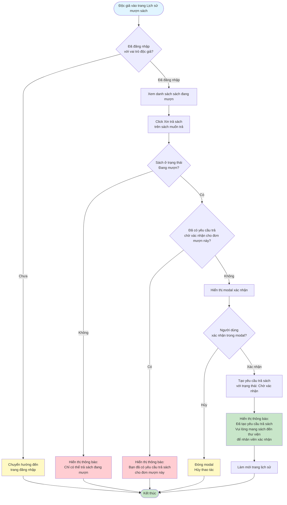

# 2.4.1 Yêu Cầu Trả Sách - Flowchart

## Mô tả
Tính năng độc giả tạo yêu cầu trả sách.

**Actor:** Độc giả  
**Phụ thuộc:** 2.1.2, 2.3.1 (Cần đăng nhập và có sách đang mượn)

## Flowchart

## Điều kiện

1. **Sách đang mượn:** Sách phải ở trạng thái "Đang mượn"
2. **Chưa có yêu cầu trả:** Một đơn mượn chỉ có thể có một yêu cầu trả ở trạng thái "Chờ xác nhận"

## Lưu ý

- Độc giả cần mang sách đến thư viện để nhân viên xác nhận
- Một đơn mượn chỉ có thể tạo một yêu cầu trả ở trạng thái "Chờ xác nhận"

## Luồng thay thế

1. **Đã có yêu cầu trả sách chờ xác nhận:** Hiển thị thông báo "Bạn đã có yêu cầu trả sách cho đơn mượn này"
2. **Sách không ở trạng thái "Đang mượn":** Hiển thị thông báo "Chỉ có thể trả sách đang mượn"

## Edge Cases

- Đã có yêu cầu trả sách chờ xác nhận cho đơn mượn này
- Sách không ở trạng thái "Đang mượn" (có thể là "Chờ xác nhận", "Đã trả", "Bị từ chối")
- Chưa đăng nhập (redirect về trang đăng nhập)
- Đơn mượn không tồn tại

