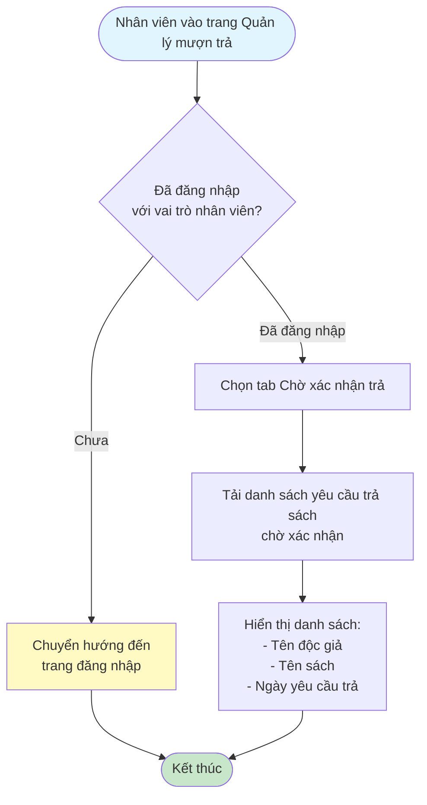
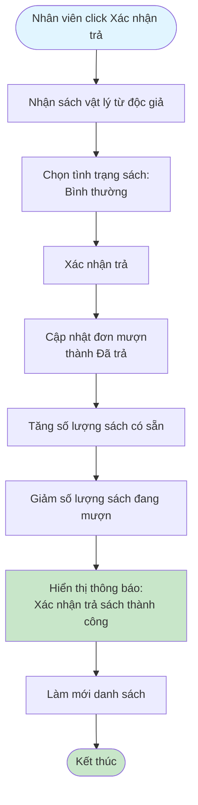
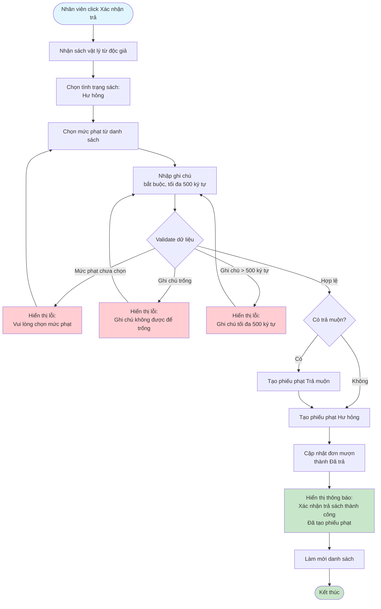
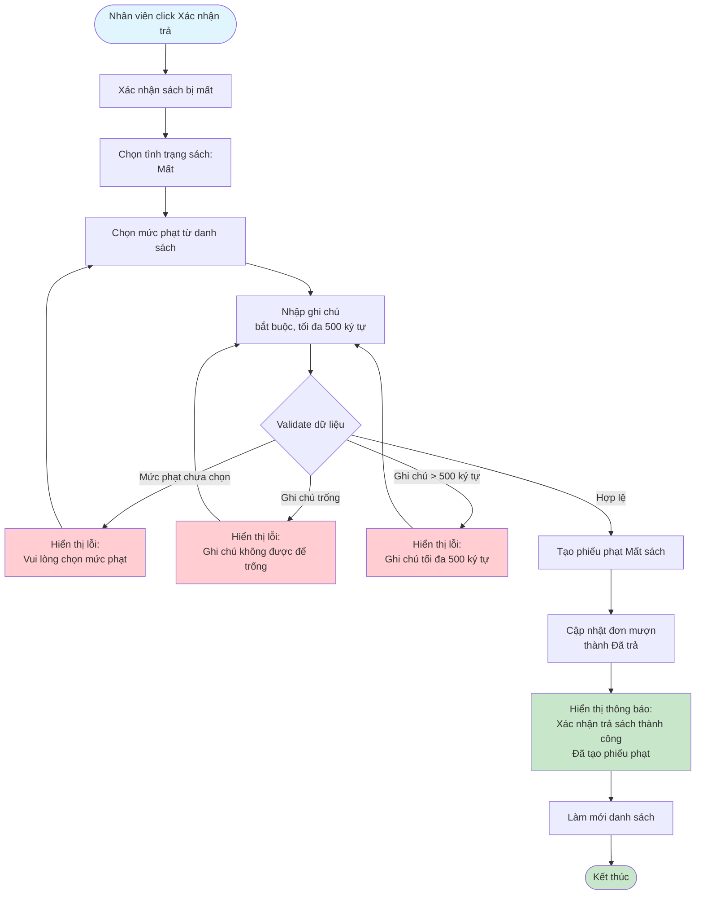

# 2.4.2 Xác Nhận Trả Sách - Flowchart

## Mô tả
Tính năng nhân viên thư viện xác nhận trả sách và xử lý các trường hợp sách bình thường, hư hỏng, hoặc mất.

**Actor:** Nhân viên thư viện  
**Phụ thuộc:** 2.1.2, 2.4.1, 2.5.1 (Cần đăng nhập, có yêu cầu trả sách, và có mức phạt)

## Flowchart - Xem Danh Sách Yêu Cầu Trả

## Flowchart - Xác Nhận Trả Sách Bình Thường

## Flowchart - Xác Nhận Trả Sách Hư Hỏng

## Flowchart - Xác Nhận Trả Sách Bị Mất

## Validation Rules

- **Tình trạng sách:** Bắt buộc chọn (bình thường, hư hỏng, mất)
- **Mức phạt:** Bắt buộc khi tình trạng là "hư hỏng", trả muộn hoặc "mất"
- **Ghi chú:** Bắt buộc khi tình trạng là "hư hỏng" hoặc "mất", tối đa 500 ký tự

## Xử lý phạt

- **Sách hư hỏng:** Tạo phiếu phạt hư hỏng + phiếu phạt trả muộn (nếu có)
- **Sách mất:** Tạo phiếu phạt mất sách
- **Sách bình thường:** Không tạo phiếu phạt

## Luồng thay thế

1. **Không chọn mức phạt:** Yêu cầu chọn mức phạt trước khi xác nhận
2. **Không nhập ghi chú:** Yêu cầu nhập ghi chú khi sách hư hỏng hoặc mất

## Edge Cases

- Tình trạng sách không được chọn
- Mức phạt không được chọn (khi hư hỏng/mất)
- Ghi chú trống hoặc quá dài (>500 ký tự)
- Mức phạt không tồn tại
- Sách trả muộn + hư hỏng → Tạo 2 phiếu phạt
- Yêu cầu trả sách không tồn tại hoặc đã được xử lý

