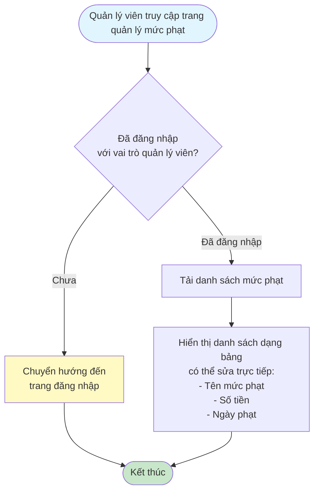
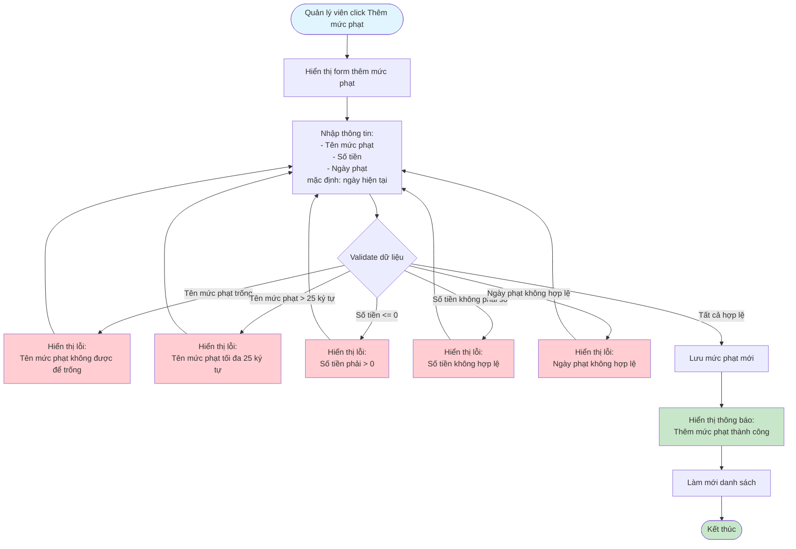
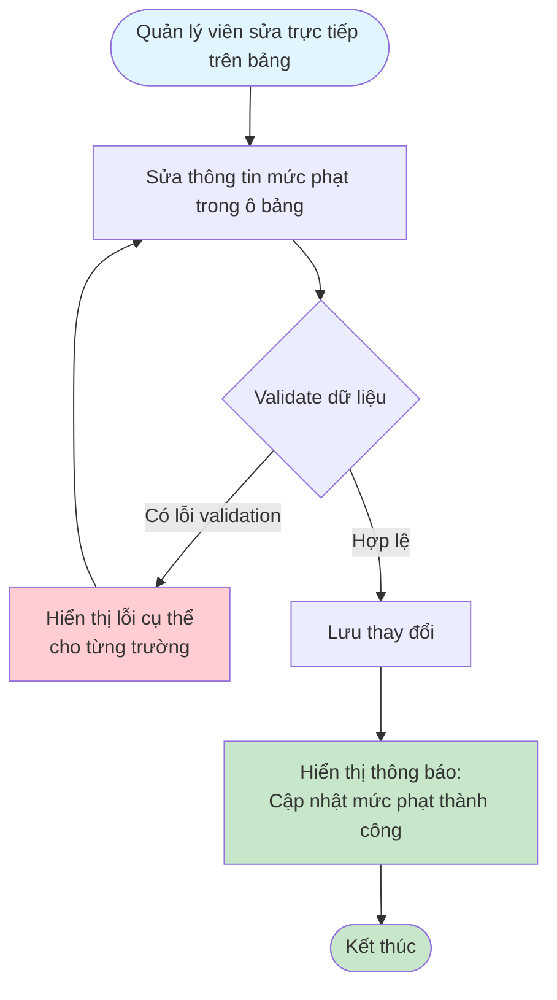
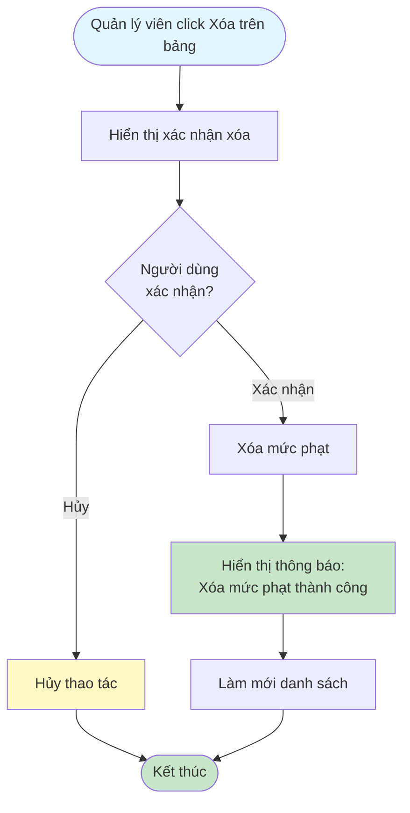

# 2.5.1 Quản lý Mức Phạt - Flowchart

## Mô tả
Tính năng quản lý viên quản lý các mức phạt trong hệ thống: xem, thêm, sửa, xóa mức phạt.

**Actor:** Quản lý viên  
**Phụ thuộc:** 2.1.2 (Cần đăng nhập với vai trò quản lý viên)

## Flowchart - Xem Danh Sách

## Flowchart - Thêm Mức Phạt

## Flowchart - Sửa Mức Phạt

## Flowchart - Xóa Mức Phạt

## Validation Rules

- **Tên mức phạt:** Không được để trống, tối đa 25 ký tự
- **Số tiền:** Phải > 0, kiểu số
- **Ngày phạt:** Ngày hợp lệ (mặc định là ngày hiện tại)

## Luồng thay thế

1. **Validation lỗi:** Hiển thị lỗi cụ thể cho từng trường không hợp lệ

## Edge Cases

- Tên mức phạt trống hoặc quá dài (>25 ký tự)
- Số tiền <= 0 hoặc không phải số
- Ngày phạt không hợp lệ
- Mức phạt đang được sử dụng (có thể cần kiểm tra trước khi xóa)

