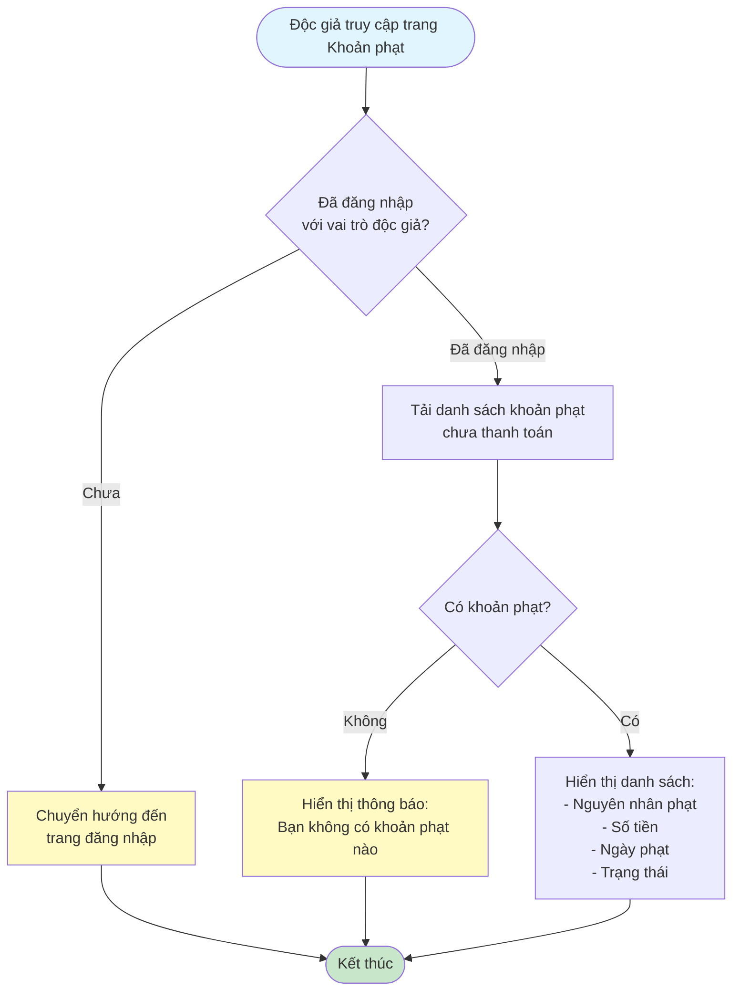
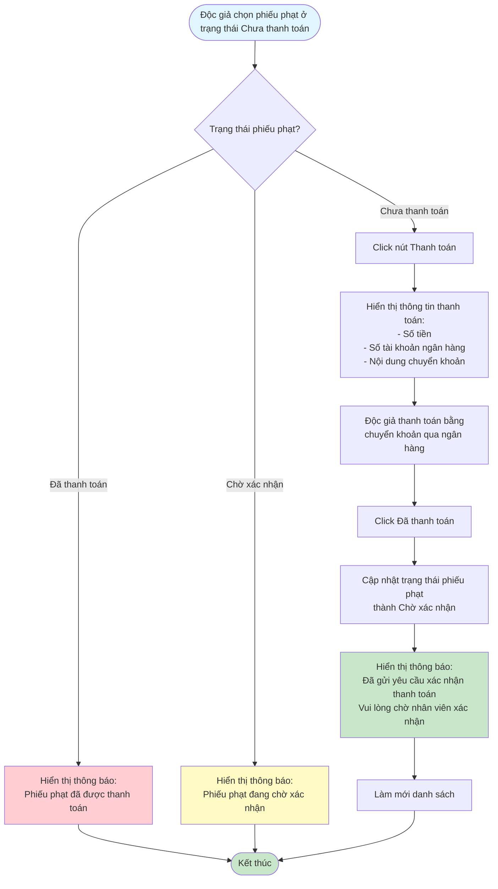

# 2.5.2 Xem & Thanh Toán Khoản Phạt - Độc Giả - Flowchart

## Mô tả
Tính năng độc giả xem và thanh toán các khoản phạt.

**Actor:** Độc giả  
**Phụ thuộc:** 2.1.2, 2.4.2, 2.5.1 (Cần đăng nhập, có phiếu phạt và mức phạt)

## Flowchart - Xem Khoản Phạt

## Flowchart - Thanh Toán

## Thông tin hiển thị

- **Danh sách khoản phạt chưa thanh toán:**
  - Nguyên nhân phạt
  - Số tiền
  - Ngày phạt
  - Trạng thái

## Trạng thái phiếu phạt

- **Chưa thanh toán:** Độc giả chưa thanh toán
- **Chờ xác nhận:** Độc giả đã thanh toán, chờ nhân viên xác nhận
- **Đã thanh toán:** Nhân viên đã xác nhận thanh toán
- **Từ chối:** Nhân viên từ chối thanh toán

## Luồng thay thế

1. **Không có khoản phạt:** Hiển thị "Bạn không có khoản phạt nào"
2. **Phiếu phạt đã thanh toán:** Không cho phép thanh toán lại
3. **Phiếu phạt đang chờ xác nhận:** Hiển thị thông báo và không cho phép thanh toán lại

## Edge Cases

- Phiếu phạt không ở trạng thái "Chưa thanh toán"
- Không có khoản phạt
- Phiếu phạt không tồn tại
- Chưa đăng nhập (redirect về trang đăng nhập)

