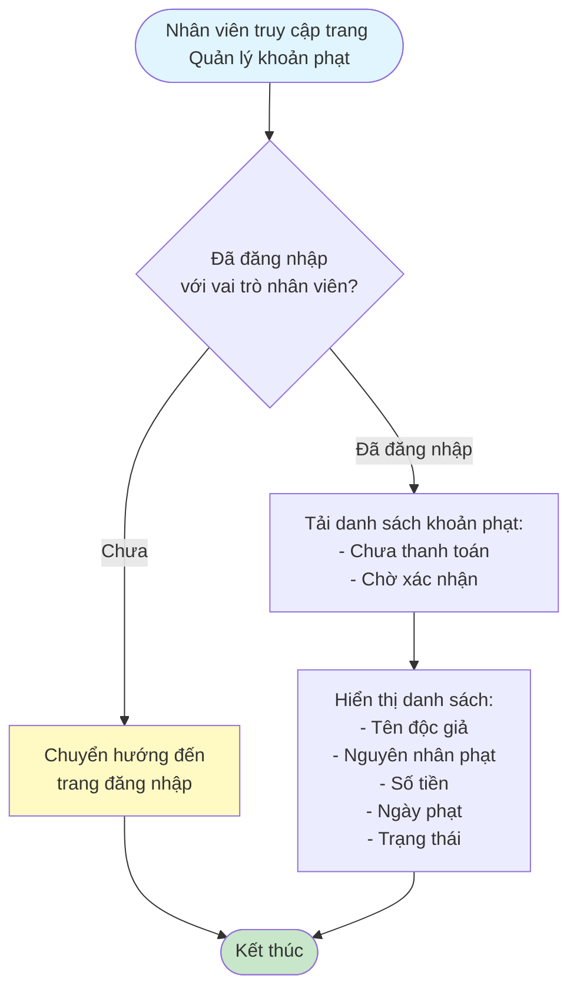
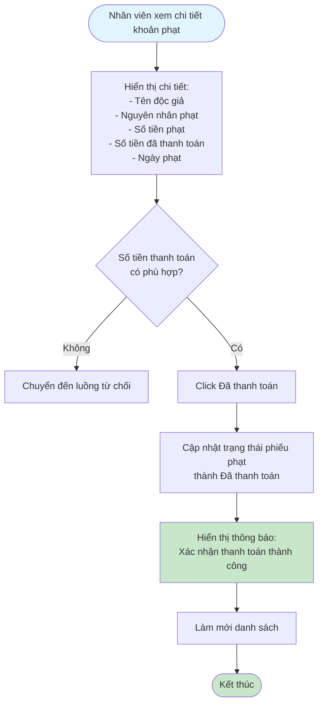
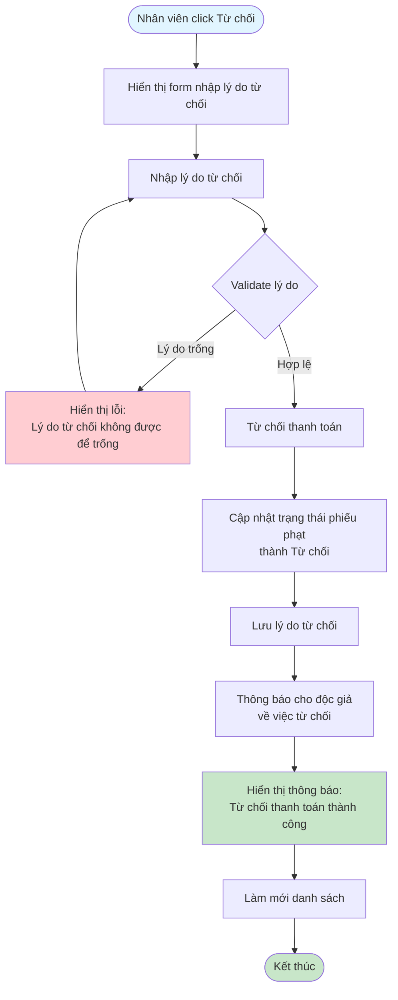

# 2.5.3 Xem & Thanh Toán Khoản Phạt - Nhân Viên Thư Viện - Flowchart

## Mô tả
Tính năng nhân viên thư viện xem và xác nhận/từ chối thanh toán khoản phạt.

**Actor:** Nhân viên thư viện  
**Phụ thuộc:** 2.1.2, 2.5.2 (Cần đăng nhập và có phiếu phạt chờ xác nhận)

## Flowchart - Xem Danh Sách

## Flowchart - Xác Nhận Thanh Toán

## Flowchart - Từ Chối Thanh Toán

## Validation Rules

- **Lý do từ chối:** Bắt buộc nhập, không được để trống

## Luồng thay thế

1. **Không nhập lý do từ chối:** Yêu cầu nhập lý do trước khi từ chối
2. **Số tiền không khớp:** Chuyển đến luồng từ chối

## Edge Cases

- Lý do từ chối trống
- Số tiền không khớp với số tiền phạt
- Phiếu phạt không tồn tại hoặc đã được xử lý

