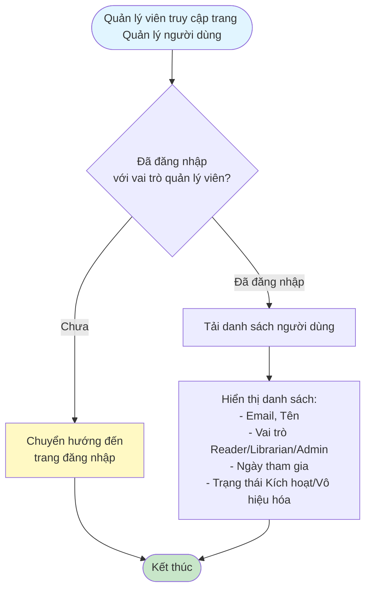
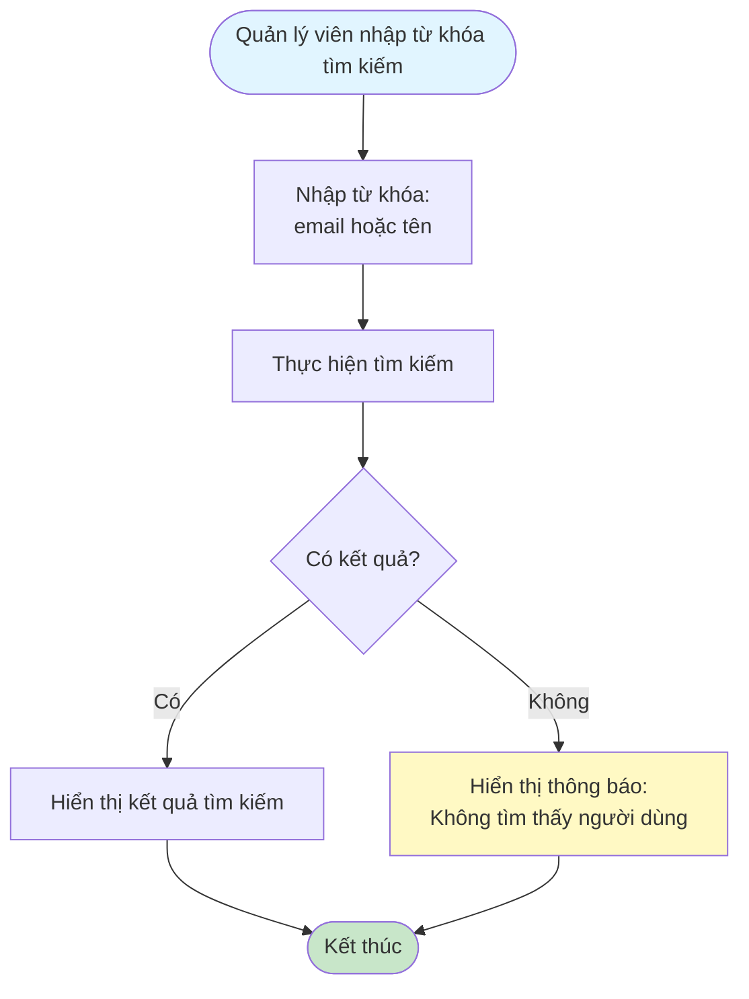
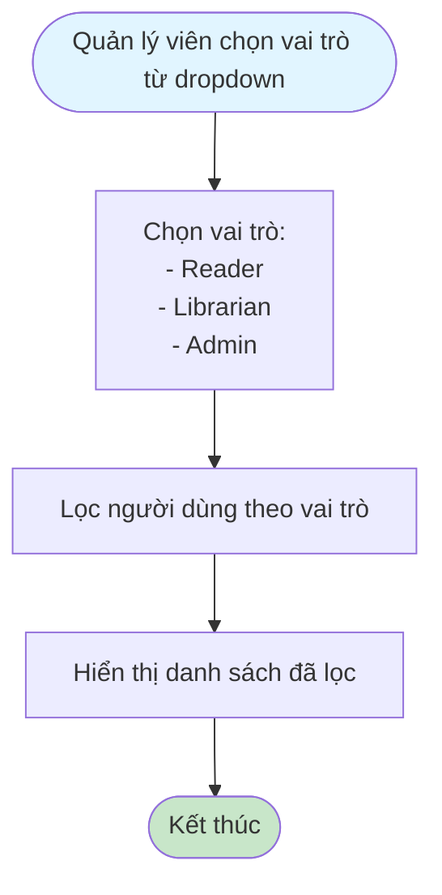
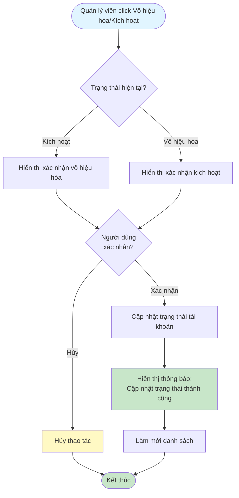

# 2.6.1 Danh Sách Người Dùng - Flowchart

## Mô tả
Tính năng quản lý viên xem danh sách người dùng, tìm kiếm, lọc và vô hiệu hóa/kích hoạt tài khoản.

**Actor:** Quản lý viên  
**Phụ thuộc:** 2.1.2 (Cần đăng nhập với vai trò quản lý viên)

## Flowchart - Xem Danh Sách

## Flowchart - Tìm Kiếm

## Flowchart - Lọc Theo Vai Trò

## Flowchart - Vô Hiệu Hóa/Kích Hoạt

## Luồng thay thế

1. **Không tìm thấy người dùng:** Hiển thị "Không tìm thấy người dùng"

## Edge Cases

- Không tìm thấy người dùng
- Vô hiệu hóa tài khoản của chính mình (có thể không cho phép)
- Tài khoản không tồn tại

