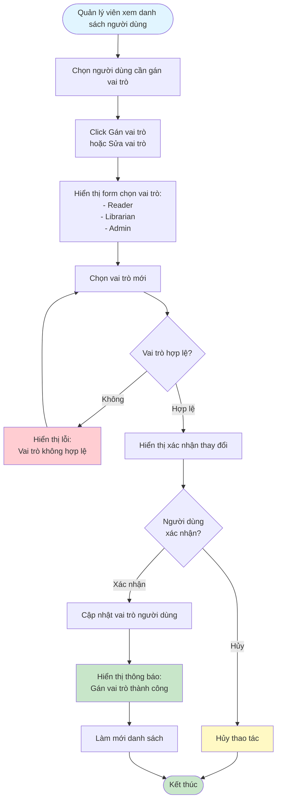

# 2.6.2 Gán Vai Trò - Flowchart

## Mô tả
Tính năng quản lý viên gán vai trò cho người dùng.

**Actor:** Quản lý viên  
**Phụ thuộc:** 2.1.2, 2.6.1 (Cần đăng nhập và có danh sách người dùng)

## Flowchart

## Vai trò trong hệ thống

- **Reader:** Chỉ có thể mượn sách, xem lịch sử cá nhân
- **Librarian:** Có thể quản lý sách, xác nhận mượn/trả, theo dõi phạt
- **Admin:** Toàn quyền, quản lý tài khoản, báo cáo, cài đặt

## Luồng thay thế

1. **Không chọn vai trò:** Yêu cầu chọn vai trò trước khi xác nhận

## Edge Cases

- Vai trò không hợp lệ
- Gán vai trò cho chính mình (có thể cần xác nhận đặc biệt)
- Người dùng không tồn tại

