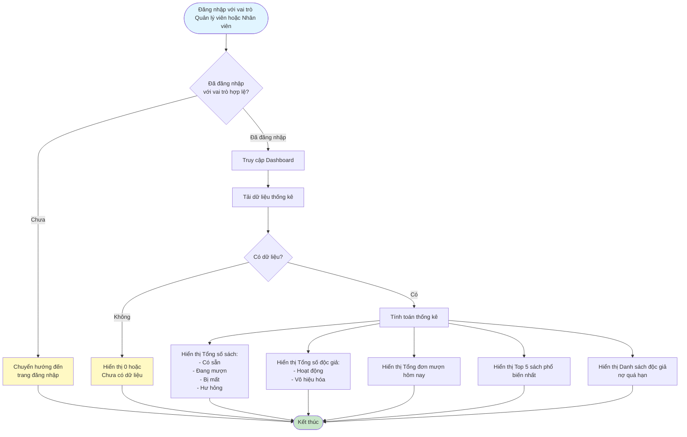

# 2.7.1 Báo Cáo Tổng Quan - Dashboard - Flowchart

## Mô tả
Tính năng hiển thị dashboard với các thống kê tổng quan.

**Actor:** Quản lý viên, Nhân viên thư viện  
**Phụ thuộc:** 2.1.2, 2.2.2, 2.3.1, 2.4.2 (Cần có dữ liệu sách, mượn, trả)

## Flowchart

## Thông tin hiển thị

- **Tổng số sách:** Có sẵn / Đang mượn / Bị mất / Hư hỏng
- **Tổng số độc giả:** Hoạt động / Vô hiệu hóa
- **Tổng đơn mượn hôm nay**
- **Top 5 sách phổ biến nhất**
- **Danh sách độc giả nợ quá hạn**

## Luồng thay thế

1. **Không có dữ liệu:** Hiển thị 0 hoặc "Chưa có dữ liệu"

## Edge Cases

- Không có dữ liệu để hiển thị
- Lỗi khi tính toán thống kê
- Không có quyền truy cập (không phải quản lý viên hoặc nhân viên)

