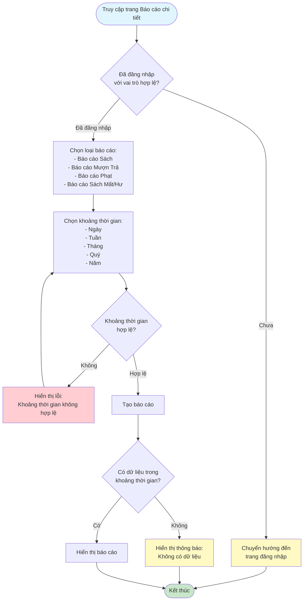
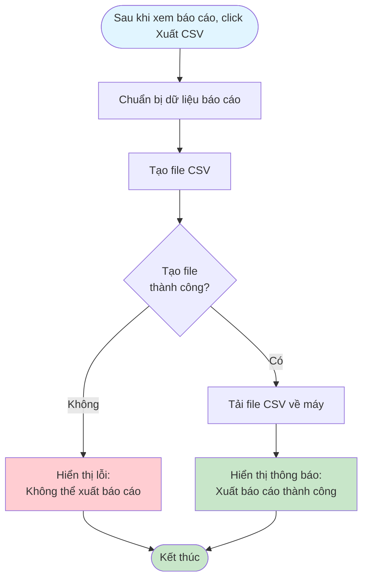

# 2.7.2 Báo Cáo Chi Tiết - Flowchart

## Mô tả
Tính năng xem và xuất các báo cáo chi tiết.

**Actor:** Quản lý viên, Nhân viên thư viện  
**Phụ thuộc:** 2.1.2, 2.7.1 (Cần có dashboard và dữ liệu đầy đủ)

## Flowchart - Xem Báo Cáo

## Flowchart - Xuất Báo Cáo CSV

## Các báo cáo có sẵn

1. **Báo cáo Sách:** Tổng số sách, tình trạng, số lần mượn
2. **Báo cáo Mượn Trả:** Số lần mượn/trả theo ngày/tháng/quý
3. **Báo cáo Phạt:** Tổng doanh thu phạt, người nợ ngoài hạn
4. **Báo cáo Sách Mất/Hư:** Danh sách sách cần thay thế

## Tính năng

- **Xuất báo cáo ra CSV**
- **Lọc theo khoảng thời gian:** Ngày, Tuần, Tháng, Quý, Năm

## Luồng thay thế

1. **Không có dữ liệu trong khoảng thời gian:** Hiển thị "Không có dữ liệu"

## Edge Cases

- Không có dữ liệu trong khoảng thời gian
- Lỗi khi xuất file CSV
- Khoảng thời gian không hợp lệ
- Không có quyền truy cập (không phải quản lý viên hoặc nhân viên)

