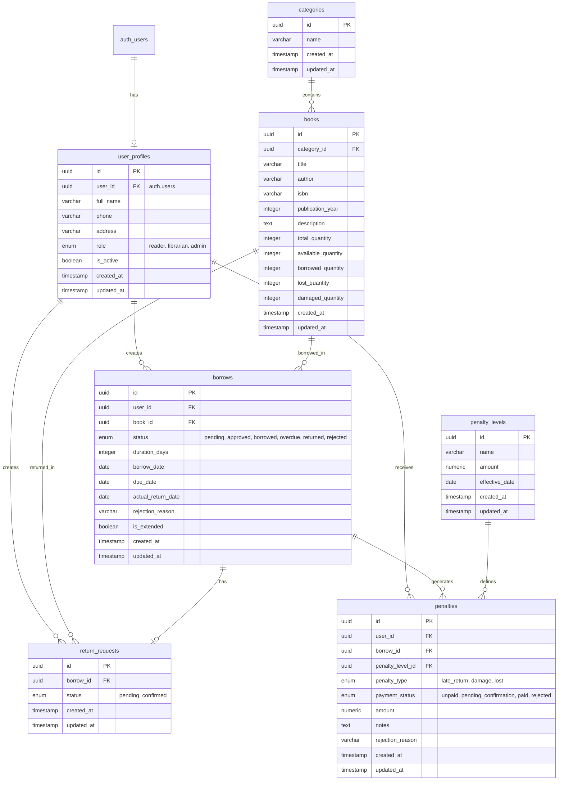

# Database Schema - Library Management System

## Entity-Relationship Diagram

## Table Descriptions

### user_profiles
Stores extended user information linked to Supabase Auth users. Each user has a role (reader, librarian, admin) and can be active or inactive.

**Key Fields:**
- `user_id`: Foreign key to `auth.users.id` (Supabase Auth)
- `role`: User role enum (reader, librarian, admin)
- `is_active`: Account status flag

### categories
Book categories managed by librarians.

**Key Fields:**
- `name`: Category name (max 50 characters)

### books
Library books with inventory tracking.

**Key Fields:**
- `category_id`: Foreign key to categories
- `total_quantity`: Total copies owned
- `available_quantity`: Copies available for borrowing
- `borrowed_quantity`: Copies currently borrowed
- `lost_quantity`: Copies lost
- `damaged_quantity`: Copies damaged

### borrows
Borrowing records tracking book loans.

**Key Fields:**
- `status`: Borrow status (pending, approved, borrowed, overdue, returned, rejected)
- `duration_days`: Loan duration (default 14, max 30)
- `due_date`: Calculated return deadline
- `is_extended`: Flag for extension (max 1 extension per borrow)
- `rejection_reason`: Reason if rejected

### return_requests
Return requests created by readers, confirmed by librarians.

**Key Fields:**
- `borrow_id`: Foreign key to borrows
- `status`: Request status (pending, confirmed)

### penalty_levels
Configurable penalty amounts managed by admins.

**Key Fields:**
- `name`: Penalty level name (max 25 characters)
- `amount`: Penalty amount
- `effective_date`: When penalty level becomes active

### penalties
Individual penalty records for late returns, damage, or lost books.

**Key Fields:**
- `penalty_type`: Type of penalty (late_return, damage, lost)
- `payment_status`: Payment status (unpaid, pending_confirmation, paid, rejected)
- `amount`: Actual penalty amount (from penalty_level)
- `notes`: Librarian notes (required for damage/lost, max 500 chars)
- `rejection_reason`: Reason if payment rejected

## Relationships

1. **user_profiles ↔ auth.users**: One-to-one (via user_id)
2. **user_profiles ↔ borrows**: One-to-many
3. **user_profiles ↔ return_requests**: One-to-many
4. **user_profiles ↔ penalties**: One-to-many
5. **categories ↔ books**: One-to-many
6. **books ↔ borrows**: One-to-many
7. **books ↔ return_requests**: One-to-many (via borrows)
8. **borrows ↔ return_requests**: One-to-one (one return request per borrow)
9. **borrows ↔ penalties**: One-to-many (multiple penalties possible: late + damage)
10. **penalty_levels ↔ penalties**: One-to-many

## Indexes

### Performance Indexes
- `user_profiles.user_id`: Unique index (one profile per auth user)
- `user_profiles.role`: B-tree index (role-based queries)
- `books.category_id`: B-tree index (category filtering)
- `books.title`, `books.author`: B-tree indexes (search)
- `borrows.user_id`: B-tree index (user borrow history)
- `borrows.book_id`: B-tree index (book borrow history)
- `borrows.status`: B-tree index (status filtering)
- `borrows.due_date`: B-tree index (overdue detection)
- `return_requests.borrow_id`: Unique index (one request per borrow)
- `return_requests.status`: B-tree index (pending returns)
- `penalties.user_id`: B-tree index (user penalties)
- `penalties.payment_status`: B-tree index (unpaid penalties)
- `penalties.borrow_id`: B-tree index (borrow-related penalties)

### Composite Indexes
- `(borrows.user_id, status)`: User's active borrows
- `(borrows.book_id, status)`: Book availability
- `(penalties.user_id, payment_status)`: User's unpaid penalties

